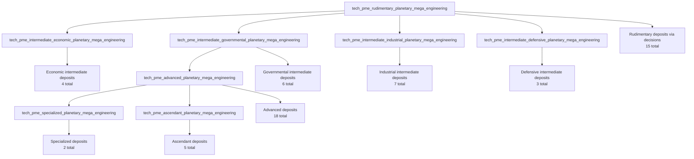

# Deposit Tiers and Unlock Paths

This file visualizes how PME deposits are reached through technology and planetary decisions.

## Core Progression Path

## Path Type

## Full Tier Catalog (Every Decision Path)

### Rudimentary
Prerequisite: `tech_pme_rudimentary_planetary_mega_engineering` (15 total)

### Base Variant
- `decision_pme_worldwide_maglev` -> `pme_d_worldwide_maglev`
- `decision_pme_polar_resource_silos` -> `pme_d_polar_resource_silos`
- `decision_pme_mining_construction` -> `pme_d_mining_construction`
- `decision_pme_planetary_irrigation_water` -> `pme_d_planetary_irrigation_water`
- `decision_pme_planetary_fusion_grid` -> `pme_d_planetary_fusion_grid`

##### Machine Variant
- `decision_pme_machine_worldwide_maglev` -> `pme_d_machine_worldwide_maglev`
- `decision_pme_machine_polar_resource_silos` -> `pme_d_machine_polar_resource_silos`
- `decision_pme_machine_system_extraction` -> `pme_d_machine_system_extraction`
- `decision_pme_machine_planetary_water_processing` -> `pme_d_machine_planetary_water_processing`
- `decision_pme_machine_planetary_fusion_grid` -> `pme_d_machine_planetary_fusion_grid`

##### Hive Variant
- `decision_pme_hive_worldwide_maglev` -> `pme_d_hive_worldwide_maglev`
- `decision_pme_hive_polar_resource_silos` -> `pme_d_hive_polar_resource_silos`
- `decision_pme_hive_mineral_extraction_warrens` -> `pme_d_hive_mineral_extraction_warrens`
- `decision_pme_hive_nutrient_processing_megaplant` -> `pme_d_hive_nutrient_processing_megaplant`
- `decision_pme_hive_planetary_fusion_grid` -> `pme_d_hive_planetary_fusion_grid`

### Intermediate Economic
Prerequisite: `tech_pme_intermediate_economic_planetary_mega_engineering` (4 total)

### Base Variant
- `decision_pme_space_elevator` -> `pme_d_space_elevator`
- `decision_pme_corporate_megacampus` -> `pme_d_corporate_megacampus`

##### Machine Variant
- `decision_pme_machine_space_elevator` -> `pme_d_machine_space_elevator`

##### Hive Variant
- `decision_pme_hive_space_elevator` -> `pme_d_hive_space_elevator`

## Intermediate Governmental
Prerequisite: `tech_pme_intermediate_governmental_planetary_mega_engineering` (6 total)

### Base Variant
- `decision_pme_supermax_prison_rehab` -> `pme_d_supermax_prison_rehab`
- `decision_pme_interstellar_hospital` -> `pme_d_interstellar_hospital`

##### Machine Variant
- `decision_pme_machine_drone_reprogramming_center` -> `pme_d_machine_drone_reprogramming_center`
- `decision_pme_machine_auxiliary_assembly_centers` -> `pme_d_machine_auxiliary_assembly_centers`

##### Hive Variant
- `decision_pme_hive_neural_regulation_nexus` -> `pme_d_hive_neural_regulation_nexus`
- `decision_pme_hive_supplemental_breeding_pools` -> `pme_d_hive_supplemental_breeding_pools`

## Intermediate Industrial
Prerequisite: `tech_pme_intermediate_industrial_planetary_mega_engineering` (7 total)

### Base Variant
- `decision_pme_subsurface_megaforges` -> `pme_d_subsurface_megaforges`
- `decision_pme_orbital_superfactory` -> `pme_d_orbital_superfactory`
- `decision_pme_chemical_hazardous_goods` -> `pme_d_chemical_hazardous_goods`

##### Machine Variant
- `decision_pme_machine_subsurface_megaforges` -> `pme_d_machine_subsurface_megaforges`
- `decision_pme_machine_chemical_hazardous_goods` -> `pme_d_machine_chemical_hazardous_goods`

##### Hive Variant
- `decision_pme_hive_subsurface_megaforges` -> `pme_d_hive_subsurface_megaforges`
- `decision_pme_hive_chemical_hazardous_goods` -> `pme_d_hive_chemical_hazardous_goods`

## Intermediate Defensive
Prerequisite: `tech_pme_intermediate_defensive_planetary_mega_engineering` (3 total)

### Base Variant
- `decision_pme_orbital_defense_grid` -> `pme_d_orbital_defense_grid`

##### Machine Variant
- `decision_pme_machine_orbital_defense_grid` -> `pme_d_machine_orbital_defense_grid`

##### Hive Variant
- `decision_pme_hive_orbital_defense_grid` -> `pme_d_hive_orbital_defense_grid`

## Advanced
Prerequisite: `tech_pme_advanced_planetary_mega_engineering` (18 total)

### Base Variant
- `decision_pme_mini_ecumenopolis` -> `pme_d_mini_ecumenopolis`
- `decision_pme_orbital_colonies` -> `pme_d_orbital_colonies`
- `decision_pme_fleet_academy` -> `pme_d_fleet_academy`
- `decision_pme_university_cityscape` -> `pme_d_university_cityscape`
- `decision_pme_resort_archipelago` -> `pme_d_resort_archipelago`
- `decision_pme_deep_mantle_exotic_hyperforge` -> `pme_d_deep_mantle_exotic_hyperforge`

##### Machine Variant
- `decision_pme_machine_global_management_nexus` -> `pme_d_machine_global_management_nexus`
- `decision_pme_machine_orbital_colonies` -> `pme_d_machine_orbital_colonies`
- `decision_pme_machine_fleet_coordination_systems` -> `pme_d_machine_fleet_coordination_systems`
- `decision_pme_machine_continental_computing_system` -> `pme_d_machine_continental_computing_system`
- `decision_pme_machine_planetwide_software_standardization_network` -> `pme_d_machine_planetwide_software_standardization_network`
- `decision_pme_machine_deep_mantle_exotic_hyperforge` -> `pme_d_machine_deep_mantle_exotic_hyperforge`

##### Hive Variant
- `decision_pme_hive_planetary_coordination_nodes` -> `pme_d_hive_planetary_coordination_nodes`
- `decision_pme_hive_orbital_colonies` -> `pme_d_hive_orbital_colonies`
- `decision_pme_hive_fleet_coordination_nexus` -> `pme_d_hive_fleet_coordination_nexus`
- `decision_pme_hive_collective_computing_consciousness` -> `pme_d_hive_collective_computing_consciousness`
- `decision_pme_hive_consciousness_synchronization_lattice` -> `pme_d_hive_consciousness_synchronization_lattice`
- `decision_pme_hive_deep_mantle_exotic_hyperforge` -> `pme_d_hive_deep_mantle_exotic_hyperforge`

## Specialized
Prerequisite: `tech_pme_specialized_planetary_mega_engineering` (2 total)

### Base Variant
- `decision_pme_gaia_biosphere_preservation_webbing` -> `pme_d_gaia_biosphere_preservation_webbing`

##### Hive Variant
- `decision_pme_hive_gaia_biosphere_preservation_webbing` -> `pme_d_hive_gaia_biosphere_preservation_webbing`

## Ascendant
Prerequisite: `tech_pme_ascendant_planetary_mega_engineering` (5 total)

### Base Variant
- `decision_pme_psionic_shroud_emitter` -> `pme_d_psionic_shroud_emitter`
- `decision_pme_gene_preservation_vaults` -> `pme_d_gene_preservation_vaults`
- `decision_pme_orbital_robotics_assembly_labs` -> `pme_d_orbital_robotics_assembly_labs`

##### Machine Variant
- `decision_pme_machine_orbital_robotics_assembly_labs` -> `pme_d_machine_orbital_robotics_assembly_labs`

##### Special Gate Variant
- `decision_pme_cybernetics_uplink_facility` -> `pme_d_cybernetics_uplink_facility`

## Authority and Tradition Gates

- Many deposits have three authority paths: regular, machine, and hive variants.
- Cybernetics Uplink Facility additionally requires the cybernetics tradition finisher in decision potential.

## Notes

- This is a decision-driven unlock structure: deposits are not randomly dropped from tier tech unlock alone.
- Late FTL origin/startup injection path has been removed in this fork.
